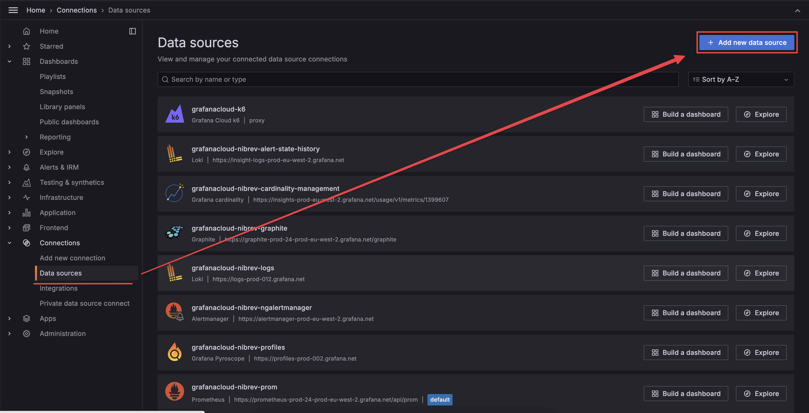
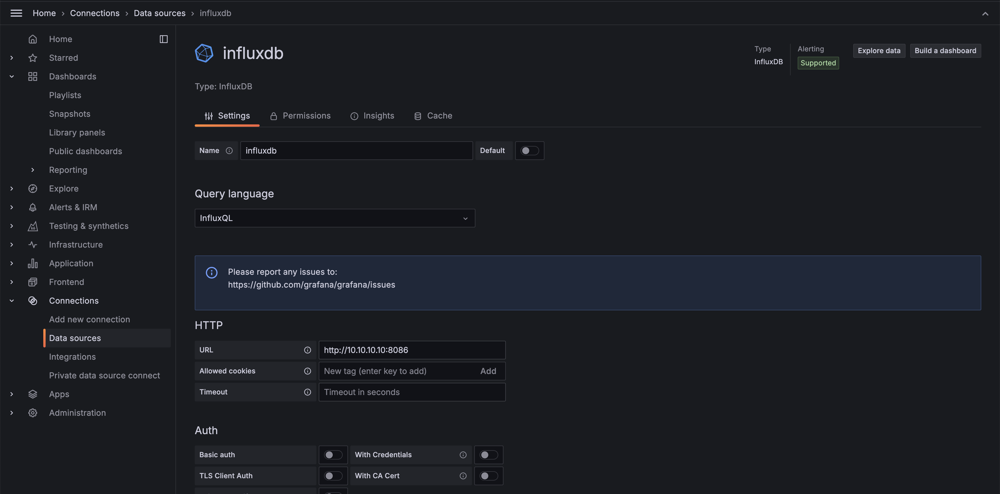
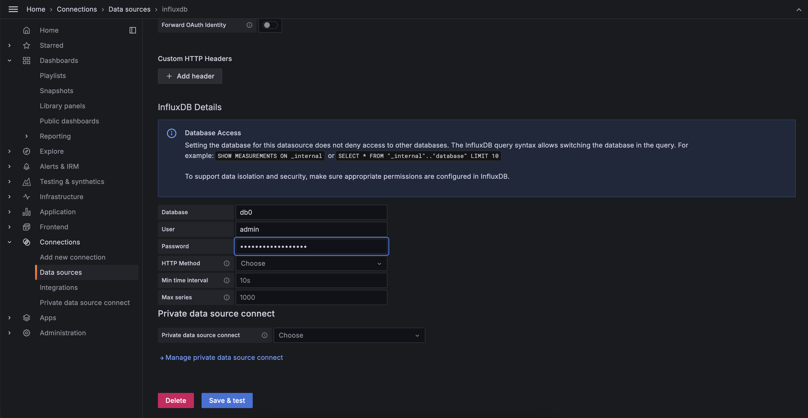

# Grafana + InfluxDB + Telegraf hosts simple monitoring
Це опис сетапу Grafana + InfluxDB + Telegraf для моніторингу хостів mhddos/adss/x100 (взагалі будь-яких, але фокус моніторингу на мережевій активності)

## База
Моніторинг складається з наступних складових
1. **Influx DB**: база данних, розміщується на хосту моніторингу
2. **Grafana**: Інтерфейс для відображення данних моніторингу, розміщується на хосту моніторинга або хостед варіант в Grafana Cloud
3. **Telegraf**: агент моніторингу, встановлюється на кожний хост, статистику з якого треба збирати

> В рамках цієї інструкції ми не будемо працювати з Grafana запущеною на своємо хості, тому-що в цьому немає жодного сенсу. [Grafana Cloud](https://grafana.com/) абсолютно безкоштовно дає "хостед" версію.
> Між тим, в docker-compose.yml є готовий до роботи контейнер з Grafana, якщо хочете своє то просто розкоментуйте і запустіть.

## Встановлення хоста моніторингу
Встановіть Docker та docker-compose, створіть директорію де будуть зберігатись файли моніторингу, додайте туди **docker-compose.yml** та запустіть контейнер.
Приклад для Ubuntu.

```shell
apt update && apt install -y docker.io docker-compose git
mkdir /home/hosts-monitoring
cd /home/hosts-monitoring

# Скачайте docker-compose.yml та замініть в ньому паролі на свої
curl -sLO https://raw.githubusercontent.com/tbinre/hosts-monitoring/main/docker-compose.yml

# Перший раз запускайте в поточному терміналі, щоб побачити помилки, якщо виникнуть
docker-compose up 
# Потім перезапустіть в фоновому режимі
docker-compose up -d
```

## Встановлення агенту на хости
Вже можна встановити Telegraf на хости які треба моніторити, щоб вони вже почати складали статистику в InfluxDB

[Отут](https://docs.influxdata.com/telegraf/v1/install/#install) описано як встановити Telegraf на різні дистрибутиви. Я залишаю приклад для Ubuntu (та Debian)

```shell
curl -s https://repos.influxdata.com/influxdata-archive_compat.key > influxdata-archive_compat.key
echo '393e8779c89ac8d958f81f942f9ad7fb82a25e133faddaf92e15b16e6ac9ce4c influxdata-archive_compat.key' | sha256sum -c && cat influxdata-archive_compat.key | gpg --dearmor | sudo tee /etc/apt/trusted.gpg.d/influxdata-archive_compat.gpg > /dev/null
echo 'deb [signed-by=/etc/apt/trusted.gpg.d/influxdata-archive_compat.gpg] https://repos.influxdata.com/debian stable main' | sudo tee /etc/apt/sources.list.d/influxdata.list
apt update && apt install -y telegraf
```

Далі вам треба оновити конфіг Telegraf. Візьміть [telegraf.conf](https://raw.githubusercontent.com/tbinre/hosts-monitoring/main/telegraf.conf) з репозиторію, та відредагуйте наступні параметри базуючись на тому, які у вас в docker-compose.yml з InfluxDB.
Вам треба замість 10.10.10.10 вказати IP свого сервера моніторингу, та той самий пароль який ви задали для користувача `user` 
### /etc/telegraf/telegraf.conf
```
[global_tags]
[agent]
  interval = "10s"
  round_interval = true
  metric_batch_size = 1000
  metric_buffer_limit = 10000
  collection_jitter = "0s"
  flush_interval = "10s"
  flush_jitter = "0s"
  precision = "0s"
  hostname = ""
  omit_hostname = false
[[outputs.influxdb]]
  urls = ["http://10.10.10.10:8086"]
  database = "db0"
  username = "user"
  password = "CHANGE_ME_PLEASE_2"
[[inputs.cpu]]
  percpu = true
  totalcpu = true
  collect_cpu_time = false
  report_active = false
  core_tags = false
[[inputs.disk]]
  ignore_fs = ["tmpfs", "devtmpfs", "devfs", "iso9660", "overlay", "aufs", "squashfs"]
[[inputs.diskio]]
[[inputs.kernel]]
[[inputs.mem]]
[[inputs.processes]]
[[inputs.swap]]
[[inputs.system]]
[[inputs.net]]
  interfaces = ["eth*", "eno*", "ens*"]
[[inputs.netstat]]
```
Для зручності, можете скачати конфіг з репозиторію на його місце, тим самим замінивши стандартний "кілометровий" конфіг
```shell
curl -sL https://raw.githubusercontent.com/tbinre/hosts-monitoring/main/telegraf.conf -o /etc/telegraf/telegraf.conf
```
> Збережіть собі цей файл та просто копіюйте на кожний хост, він однаковий для всіх.


Після додавання (зміни) конфігу (пере)запустіть та додайте Telegraf до автозапуску.
```shell
systemctl enable telegraf
systemctl restart telegraf
```
> Перед першим запуском Telegraf перевірте хостнейм хоста, він буде використовуватись в Grafana. Якщо хостнейм змінити потім то він звісно зміниться, але і старий з історії в InfluxDB нікуди не дінеться. Звісно можна буде видалити, але то морока ще та.
> Встановити новий хостнейм: `hostnamectl hostname myhost01`

## Запуск дашборду Grafana
Створіть обліковий запис на [Grafana Cloud](https://grafana.com/) або запустіть свою Grafana (про що було вище)

### Додати Data Source
Data Source - це база данних статистики, в цьому випадку InfluxDB. В меню знайдіть Connections -> Data Sources -> Add new data source


Які параметри треба задати
- Name: довільна назва (influxdb)
- URL: IP та порт вашої InfluxDB 
- Database: назва бази данних вказана в docker-compose.yml
- User: Адмін юзер бази
- Password: пароль адміну




Save & Test

### Додати дашборд
Дашборд це шаблон описуючий як треба малювати ті чи інші статистичні данні з вашої бази статитстики.

Шукайте Dashboards -> New -> New dashboard

Нас цікавить імпорт існуючого дашборду.

Імпортуйте вміст файлу [tbin-dashboard.json](https://raw.githubusercontent.com/tbinre/hosts-monitoring/main/tbin-dashboard.json) та виберіть створений на попередньому кроці "Data source"


> Мій дашборд це "покоцана" версія інснуючого публічного дашборду, з деякими доробками (Traffic [ALL] та Traffic [selection], при чому ALL працює не завжди адекватно і треба декілька разів оновлювати сторінку щоб отримати правильне значення).
> 
> Можете подивитись і інші дашборди, може щось підійде більше.
> Всі вони будуть відображати вже існуючу статистику з вашої InfluxDB: https://grafana.com/grafana/dashboards/?dataSource=influxdb&collector=telegraf